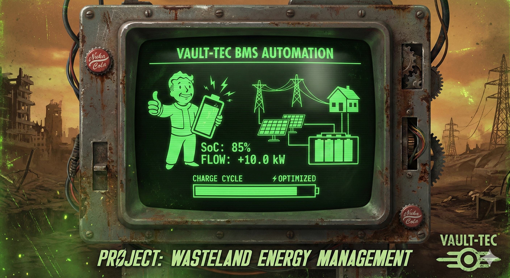

# Vault-Tec BMS Automation (v1.2.0)



> *"Prepared for the Future."*

**Vault-Tec BMS** is an advanced, heuristic-based energy management system designed for Home Assistant and FoxESS inverters. Unlike standard schedulers, this system calculates the **exact minute** charging must start to achieve the target State of Charge (SoC) precisely when the tariff window ends.

---

## ⚙️ System Overview

This system replaces dumb timers with intelligent, environmental-aware logic. It creates a bridge between your solar forecast, weather conditions, and battery physics.

### Core Assumptions
1.  **Just-in-Time Charging:** The battery should finish charging exactly at the end of the cheap tariff window (06:00 or 15:00). Sitting at 100% SoC for hours is inefficient and harmful to cells.
2.  **Solar First:** If the forecast predicts enough sun to cover demand, grid charging is reduced or cancelled.
3.  **Environmental Awareness:** Cold batteries charge slower. Heat pumps consume more power in winter. The system adjusts math based on temperature and season.
4.  **Race Condition Safety:** The system is immune to "Unavailable/Unknown" states during Home Assistant restarts.

---

## 🧠 How It Works (The Logic Loop)

The brain of the operation resides in `bms.jinja`. Every minute, the system performs the following calculations:

### 1. Data Acquisition
It gathers real-time telemetry:
* **Battery Status:** Current SoC (via direct Modbus).
* **Solar Forecast:** Solcast / Forecast.solar data for the remaining day.
* **Environment:** Outdoor temperature, weather condition, season.
* **Time Windows:** Target hours (06:00 / 15:00).

### 2. The Heuristic Calculation
The system calculates the **Energy Deficit**:
$$ \text{Needed kWh} = \min(\text{Predicted Demand}, \text{Capacity}) - \text{Current Energy} $$

Then, it applies **Dynamic Modifiers**:
* **Season Factor:** Adjusts demand prediction based on time of year (e.g., Winter = 1.8x demand).
* **Weather Factor:** Reduces solar confidence during rain/snow.
* **Temp Factor:** Adjusts efficiency assumptions based on ambient temperature.

### 3. Execution (The Trigger)
Finally, it solves for $T_{start}$:
$$ T_{start} = T_{target} - \left( \frac{\text{Grid Needed (kWh)}}{\text{Charge Power (kW)}} \times 1.1 \right) $$
*(1.1 is a 10% efficiency buffer)*

When `now() >= calculated_start_time`, the Automation triggers:
1.  **Switch Inverter Mode:** Sets FoxESS to `Force Charge`.
2.  **Notify Overseer:** Sends a Mobile App notification with current SoC.

When the target hour is reached (06:00/15:00), the system performs a **Hard Stop**, reverting the inverter to `Self Use`.

---

## 📂 Project Structure

| File | Description |
| :--- | :--- |
| **`config/custom_templates/bms.jinja`** | **The Brain.** Contains the heavy mathematical macros and logic modifiers. |
| **`config/packages/bms/1_infrastructure.yaml`** | **The Hardware.** Input Booleans (Safety Switch) and Modbus Proxy sensors. |
| **`config/packages/bms/2_logic.yaml`** | **The Sensors.** Template sensors that expose the calculated start times to HA. |
| **`automation_reference.yaml`** | **The Enforcer.** The actual Automation code (Triggers & Actions) to be used in HA UI. |

---

## 🚀 Installation

1.  **Copy Files:** Move `packages` and `custom_templates` folders to your Home Assistant `/config/` directory.
2.  **Update Config:** Ensure your `configuration.yaml` allows packages:
    ```yaml
    homeassistant:
      packages: !include_dir_named packages
    ```
3.  **Restart:** Reboot Home Assistant Core.
4.  **Create Automation:** Copy the code from `automation_reference.yaml` and paste it into a new Automation (Edit in YAML mode).
5.  **Add Image:** Place your logo at `Vault_Tec_BMS/images/image.png`.

---

## 🛡️ Safety Protocols

* **Master Switch:** An `input_boolean.bms_automation` acts as a Kill Switch. If OFF, no actions are taken.
* **Hysteresis:** Charging will not trigger if SoC is already > 95%.
* **Startup Protection:** Logic includes `is not none` checks to prevent false triggers during HA boot-up.

---

*Property of RobCo Industries. Unauthorized access is a Class A felony.*
END_README
